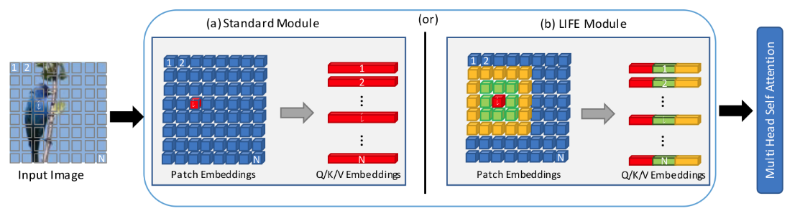
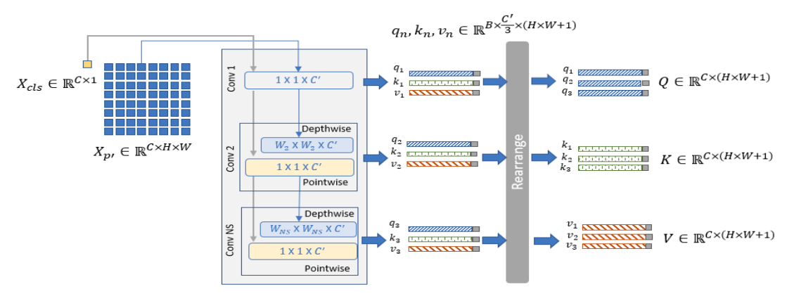
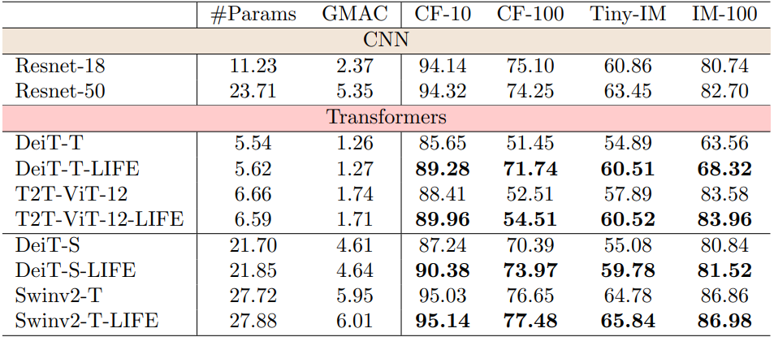
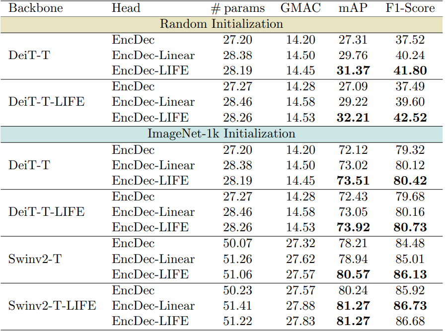
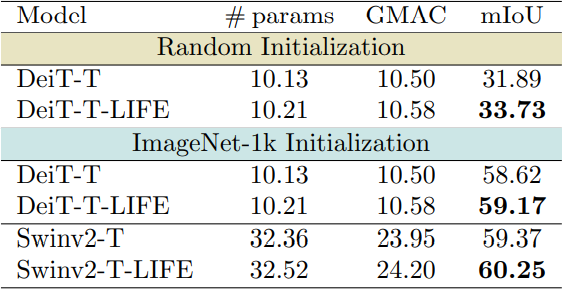

# LIFE


This repo is an official implementation for the Local InFormation Extractor (LIFE) Module framework.

|                          |
|--------------------------------------------------------------|
| <div style="text-align: center;">LIFE Module Data Flow</div> |

## Installation
### Requirements
- Python >= 3.6
- PyTorch >= 1.8 and torchvision
- timm: 
	- `pip install timm`

### Prepare data
Download and extract ImageNet100 train and val images from https://www.kaggle.com/datasets/ambityga/imagenet100.

The directory structure is the standard layout for the torchvision [`datasets.ImageFolder`](https://pytorch.org/docs/stable/torchvision/datasets.html#imagefolder), and the training and validation data is expected to be in the `train/` folder and `val/` folder respectively:

```
/path/to/ImageNet100/
  train/
    class1/
      img1.jpeg
    class2/
      img2.jpeg
  val/
    class1/
      img3.jpeg
    class/2
      img4.jpeg
```

## Usage

### Training
```
# Running training procedure with specific GPU number
./tools/run_dist_launch.sh <GPU_NUM> python main.py [optional arguments]
```
Example command for training DeiT Small with LIFE module with batch size of 512 on 2 GPUs
```shell
./tools/run_dist_launch.sh 2 python main.py --data-path /path/to/ImageNet100 --data-set IMNET100 --model deit_small_patch16_224_ms --batch-size 256 --input-size 224 --epochs 300 --output_dir /path/to/output/folder
```
Please refer to main.py for more optional arguments

### Inference
```
# Running inference procedure with specific GPU number and model path
./tools/run_dist_launch.sh <GPU_NUM> <path_to_config> --eval --resume <model_path> [optional arguments]
```
Please refer to main.py for more optional arguments

### Image Classification Results



### Object Detection Results on the VOC dataset



### Semantic Segmentation Results on the CityScapes dataset



## Citation

Please cite the paper in your publications if it helps your research.

```
@article{akkaya2024enhancing,
  title={Enhancing performance of vision transformers on small datasets through local inductive bias incorporation},
  author={Akkaya, Ibrahim Batuhan and Kathiresan, Senthilkumar S and Arani, Elahe and Zonooz, Bahram},
  journal={Pattern Recognition},
  pages={110510},
  year={2024},
  publisher={Elsevier}
}
```

## Acknowledgements
This code is heavily borrowed from [VTPack](https://github.com/StevenGrove/vtpack).
